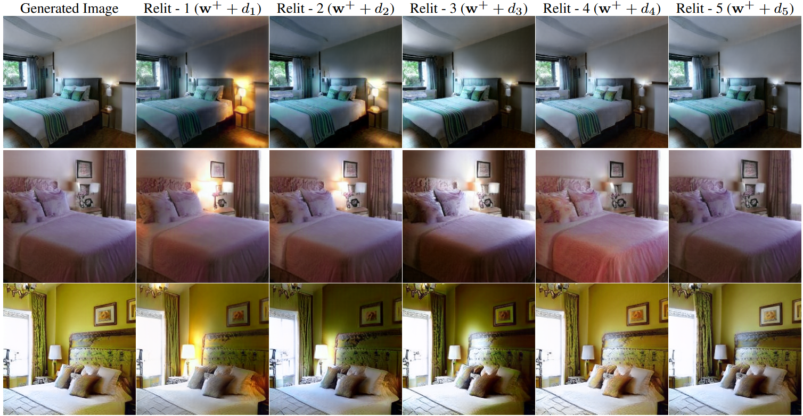

## StyLitGAN: Image-based Relighting via Latent Control

<!--  -->

**StyLitGAN: Image-based Relighting via Latent Control**<br>
Anand Bhattad, James Soole, D.A. Forsyth<br>
[Project Page](https://anandbhattad.github.io/stylitgan/) | 
[Paper](https://anandbhattad.github.io/stylitgan/2024_CVPR_StyLitGAN_FINAL.pdf) | [arXiv](https://arxiv.org/abs/2205.10351)<br>

Abstract: *We describe a novel method, StyLitGAN, for relighting and resurfacing images in the absence of labeled data. StyLitGAN generates images with realistic lighting effects, including cast shadows, soft shadows, inter-reflections, and glossy effects, without the need for paired or CGI data. StyLitGAN uses an intrinsic image method to decompose an image, followed by a search of the latent space of a pretrained StyleGAN to identify a set of directions. By prompting the model to fix one component (e.g., albedo) and vary another (e.g., shading), we generate relighted images by adding the identified directions to the latent style codes. Quantitative metrics of change in albedo and lighting diversity allow us to choose effective directions using a forward selection process. Qualitative evaluation confirms the effectiveness of our method.*


## Requirements
 * Python Libraries: `pip install click requests ninja notebook`
 * Requirements are largely the same as in the [Official StyleGan2 Pytorch Implementation](https://github.com/NVlabs/stylegan2-ada-pytorch/tree/main?tab=readme-ov-file#requirements:~:text=the%20quality%20metrics-,Requirements,-Linux%20and%20Windows)
 * We have tested on Linux with `python=3.9.18`, `pytorch=2.1.1 torchvision=0.16.1 pytorch-cuda=11.8`, `Conda 23.7.3`, `CUDA Version: 11.6`
 * We recommend installing PyTorch (find a compatible version for your CUDA device [here](https://pytorch.org/get-started/previous-versions/)) then doing `pip install` as above
 * also see provided `environment.yml`

## Getting Started
See `stylitgan.ipynb` for sample relightings using latent directions given in `stylitgan_directions_7.npy`.
Latent directions were found for a model trained on LSUN-Bedroom, provided in `stylitgan_bedroom.pkl`.
Running the trained model requires utils obtained from [StyleGan2](https://github.com/NVlabs/stylegan2-ada-pytorch/tree/main).

## Citation
```
@InProceedings{StyLitGAN,
    title = {StyLitGAN: Image-based Relighting via Latent Control},
    author = {Bhattad, Anand and Soole, James and Forsyth, D.A.},
    booktitle = {Proceedings of the IEEE/CVF Conference on Computer Vision and Pattern Recognition (CVPR)},
    year = {2024}
}
```

## Acknowledgement 
We thank Aniruddha Kembhavi, Derek Hoiem, Min Jin Chong, and Shenlong Wang for their feedback and suggestions. We also thank Ning Yu for providing us with pretrained StyleGAN models. This material is based upon work supported by the National Science Foundation under Grant No. 2106825 and by a gift from the Boeing Corporation.


